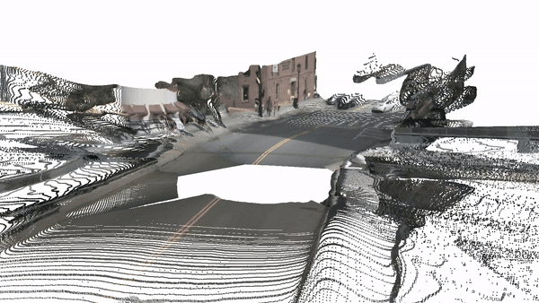

> [**UniDepth: Universal Monocular Metric Depth Estimation**](),  
> Luigi Piccinelli, Yung-Hsu Yang, Christos Sakaridis, Mattia Segu, Siyuan Li, Luc Van Gool, Fisher Yu,  
> CVPR 2024 (to appear),  
<!-- > *Paper ([arXiv 2304.06334](https://arxiv.org/pdf/2304.06334.pdf))*   -->


## Installation

Install the environment needed to run UniDepth with:
```shell
export VENV_DIR=<YOUR-VENVS-DIR>
export NAME=Unidepth

python -m venv $VENV_DIR/$NAME;
source $VENV_DIR/$NAME/bin/activate;
pip install -r requirements.txt
export PYTHONPATH="$PWD:$PYTHONPATH"
```

Note: Make sure that your compilation CUDA version and runtime CUDA version match.
You can check the supported CUDA version for precompiled packages on the [PyTorch website](https://pytorch.org/).

Run UniDepth on the given assets to test your installation:
```shell
python ./scripts/demo.py
```


## Get Started

For easy-to-use, we provide our models via torchhub, the following script is an example on how to use it from your code.
The intrinsics can be either passed (will be used) or not. The infer method takes care of the pre- and post-processing. 
```python
import torch
import numpy as np
from PIL import Image


model = torch.hub.load("lpiccinelli-eth/UniDepth", "UniDepthV1_ViTL14", pretrained=True, trust_repo=True)
rgb = torch.from_numpy(np.array(Image.open(...))).permute(2,0,1) # do not normalize
intrinsics = torch.from_numpy(np.load(...)) if exists else None

predictions = model.infer(rgb, intrinsics)

depth = predictions["depth"]
xyz = predictions["points"]
intrinsics = predictions["intrinsics"]
```

To use the forward method you should format the input as:
```python
data = {"image": rgb.unsqueeze(0), "K": intrinsics.unsqueeze(0)}
predictions = model(data, {})
```

Available models (so far) on TorchHub and HuggingFace:

1. UniDepthV1_ViTL14
2. UniDepthV1_ConvNextL

Please visit our [HuggingFace](https://huggingface.co/lpiccinelli/UniDepth) to access models weights.


## Zero-Shot Visualization

<!-- ### YouTube (The Office)
<p align="center">
  
</p> -->


### Nuscenes
<p align="center">
  
</p>


## License

This software is released under Creatives Common BY-NC 4.0 license. You can view a license summary [here](LICENSE).


## Contributions

If you find any bug in the code, please report to <br>
Luigi Piccinelli (lpiccinelli_at_ethz.ch)


## Acknowledgement

This work is funded by Toyota Motor Europe via the research project [TRACE-Zurich](https://trace.ethz.ch) (Toyota Research on Automated Cars Europe).
